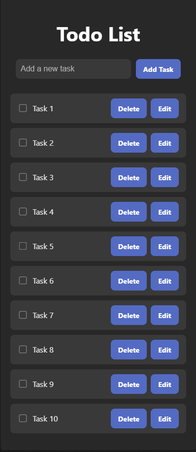

# 📝 Todo List App (React + Vite)

Esta es una aplicación simple de lista de tareas (Todo List) desarrollada con **React** y **Vite**. Te permite:

- ✅ Agregar tareas
- ✏️ Editar tareas
- 🗑️ Eliminar tareas
- ☑️ Marcar tareas como completadas

---

## 🚀 Tecnologías utilizadas

- [React](https://reactjs.org/)
- [Vite](https://vitejs.dev/)
- JavaScript
- CSS

---

## 📦 Instalación

### 1. Cloná el repositorio

git clone https://github.com/tu-usuario/todo-list-app.git
cd todo-list-app

--- 

### 2. Instalación de dependencias

- npm install

--- 

### 3. Ejecutá la app en modo desarrollo

- npm run dev

- Esto abrirá la aplicación en http://localhost:5173/

--- 

## ✨ Captura de pantalla

  

